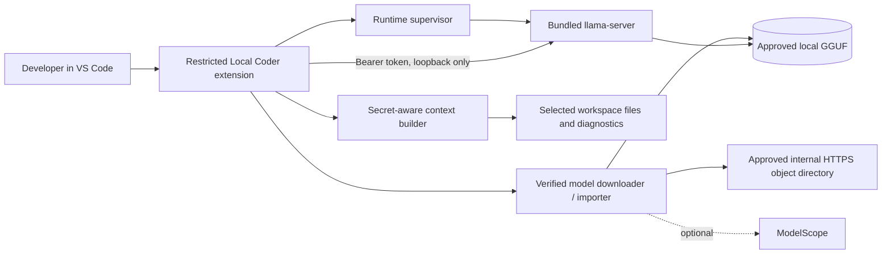

# Architecture

## Design goal

Provide a useful local coding assistant on a 32 GB enterprise laptop without requiring a separately installed model manager, Python environment, container runtime, administrator privileges, or Hugging Face access.

## Runtime topology



## Build-time flow

1. GitHub Actions reads `vendor/llama.cpp.lock.json`.
2. It fetches the exact 40-character commit from `ggml-org/llama.cpp` and verifies `HEAD` byte-for-byte against the lock.
3. It builds only the CPU `llama-server` target, with the Web UI excluded from the build.
4. The server, selected native libraries, and the upstream license are copied into `extension/runtime/<platform-arch>/`.
5. `@vscode/vsce` creates a platform-specific VSIX and a SHA-256 sidecar.
6. The target laptop installs that VSIX; it performs no native build and needs no Node, Python, Git, CMake, or compiler.

## Model acquisition flow

1. The extension loads the checked-in allow-list in `extension/models/manifest.json`.
2. The user accepts the model license and selects a profile.
3. Sources are tried in this order: managed internal HTTPS mirror, approved ModelScope URL, or explicit local-file import.
4. Hugging Face hostnames and their subdomains are denied. Public cleartext HTTP is denied; HTTP is accepted only for a loopback development server.
5. Network acquisition writes to `<model>.part`, uses HTTP `Range` when available, and revalidates every redirect.
6. Before use, the extension requires GGUF magic bytes, an exact size when the manifest supplies one, and an approved SHA-256.
7. A validated hash is cached with the absolute path, file size, and modification time. Any file change forces a full rehash.
8. Invalid final or staged files are removed from the approved path and quarantined where possible.

## Request-time flow

1. A user sends a chat request, invokes a selection command, or VS Code asks for an inline completion.
2. The extension gathers bounded context from the active selection, nearby code, diagnostics, open files, lexical workspace retrieval, and explicitly configured files.
3. Active sensitive files and common secret locations are rejected, including `.env*`, private keys, credential files, `.vscode`, `.ssh`, `.aws`, `.azure`, `.gnupg`, and `.kube`.
4. Reserved wrapper tags are neutralized, code fences grow beyond any backtick run in the source, and the resulting blocks are explicitly labeled as untrusted data.
5. Chat uses the OpenAI-compatible `/v1/chat/completions` route with streaming.
6. Qwen Coder inline completion uses llama.cpp's `/completion` route and fill-in-the-middle tokens.
7. Responses travel only over a bearer-authenticated loopback connection.

## Runtime process contract

The extension launches `llama-server` with a sanitized child environment. On Linux and macOS, the native-library search path is reset to the directory containing the approved runtime rather than inherited from the parent process. Runtime controls are equivalent to:

```text
child environment: LLAMA_API_KEY=<random SecretStorage value>

--model <approved-local.gguf>
--alias local-coder
--host 127.0.0.1
--port <free-loopback-port>
--ctx-size <profile-or-user-value>
--threads <auto-or-user-value>
--threads-batch <same>
--batch-size <profile-value>
--ubatch-size <profile-value>
--parallel 1
--cache-ram <bounded setting; 512 MiB by default>
--no-cache-idle-slots
--cache-type-k q8_0
--cache-type-v q8_0
--load-mode mmap
--flash-attn auto
--jinja
--no-webui
--no-agent
--offline
--cors-origins localhost
--no-cors-credentials
--no-slots
```

The API key is not placed on the process command line. Inherited `LLAMA_*`, `GGML_*`, Hugging Face, and dynamic-library injection variables are stripped before the child starts. User-supplied extra arguments cannot override model, network, authentication, logging, agent/tool, context, parallelism, cache, or endpoint controls.

## Persistence

- Model files: configurable user-level application-data directory, outside the extension installation.
- Validation record: VS Code global state; it stores only file metadata and the approved digest.
- API key: VS Code SecretStorage.
- Selected profile and accepted license: VS Code global state.
- Conversation: memory only; cleared with the extension host.
- Runtime logs: Local Coder output channel; prompt logging flags are blocked.

## Failure isolation

- The runtime is a supervised child process and can be stopped without closing VS Code.
- A partial network download remains resumable as `.part`.
- A hash mismatch never reaches the approved model path.
- The extension never falls back to cloud inference.
- Runtime exit, model validation, acquisition, and context-selection failures are surfaced separately.
